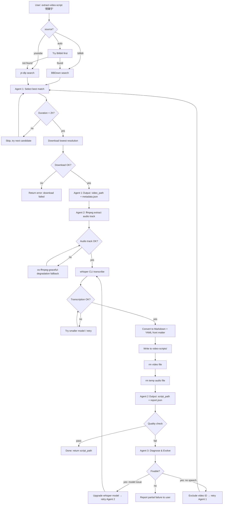

# PRD: extract-video-script — 影片腳本提取工具

## 1. 工具概述

`extract-video-script` 是一個本機 CLI 工具，讓 Claude Code 透過 2-3 個 Agent 自動完成：搜尋 Bilibili/YouTube 教學影片 → 下載最低解析度 → 本機 Whisper 語音轉文字 → 刪除影片/音軌 → 輸出 Markdown 腳本。

**一句話：** 輸入關鍵字，輸出 `.md` 腳本，中間不留任何影片/音軌檔案。

---

## 2. 技術棧與安裝指令

### 2.1 已確認可用（本機已安裝或技能已就緒）

| 工具 | 用途 | 驗證指令 |
|------|------|----------|
| `yt-dlp` | YouTube 下載 | `yt-dlp --version` |
| `ffmpeg` | 音軌提取 / 格式轉換 | `ffmpeg -version` |
| `whisper` | 本機語音轉文字（OpenAI Whisper CLI） | `whisper --help` |
| `python3` | Agent 膠水層 / JSON 處理 | `python3 --version` |
| `sci-openai-whisper` | Whisper 技能封裝 | 已載入 skills/ |
| `os-ffmpeg-encoder-check` | FFmpeg 編碼器可用性檢測 | 已載入 skills/ |
| `os-ffmpeg-graceful-degradation` | FFmpeg 容錯降級策略 | 已載入 skills/ |
| `sci-video-frames` | 影片幀提取（場景檢測輔助） | 已載入 skills/ |
| `caveman` | 精簡編碼風格 | 已載入 skills/ |

### 2.2 需安裝

| 工具 | 用途 | 安裝指令 |
|------|------|----------|
| **BBDown** | Bilibili 影片下載（強制首選） | `winget install nilaoda.BBDown` 或從 [GitHub Releases](https://github.com/nilaoda/BBDown) 下載 `BBDown.exe` 放到 PATH |
| **page-agent** | 瀏覽器搜尋（B站/YT 搜尋結果爬取） | `git clone https://github.com/alibaba/page-agent.git` 後 `pip install -e .` |

### 2.3 技能衝突警告

| 技能 | 問題 | 處置 |
|------|------|------|
| `sci-openai-whisper-api` | **雲端 API**（OpenAI Audio Transcriptions），違反「嚴禁雲端語音轉文字」規則 | **禁用。** Agent 2 僅使用 `sci-openai-whisper`（本機 whisper CLI） |

### 2.4 現有技能的角色重新定義

`os-audio-track-production` 和 `os-audio-track-production-enhanced` 原本是音樂製作技能（stems、BPM、混音）。在此工具中僅借用其 **ffmpeg 音軌提取模式** 和 **增量驗證哲學**，不執行音樂相關流程。Agent 2 直接使用 ffmpeg 命令列提取音軌。

---

## 3. 環境診斷結果（2026-04-29）

| 工具 | 狀態 | 版本/說明 |
|------|------|-----------|
| dotnet | ✅ 已安裝 | 8.0.409 |
| python3 | ✅ 已安裝 | 3.14.4 |
| ffmpeg | ❌ 未安裝 | — |
| yt-dlp | ❌ 未安裝 | — |
| BBDown | ❌ 未安裝 | 需從 GitHub Releases 下載 |
| node + npx | ❌ 未安裝 | page-agent 依賴 |
| whisper (openai-whisper) | ❌ 未安裝 | `pip install openai-whisper` |
| faster-whisper | ❌ 未安裝 | 備選引擎 |
| jq | ❌ 未安裝 | JSON 處理 |

---

## 4. Phase 0：環境準備（安裝指令）

### 4.1 ffmpeg

```powershell
winget install Gyan.FFmpeg
# 安裝後重啟終端，驗證：
ffmpeg -version
```

- 安裝路徑：`C:\Program Files\ffmpeg\bin\`
- 需手動加入 PATH：`setx PATH "%PATH%;C:\Program Files\ffmpeg\bin"`

### 4.2 yt-dlp

```powershell
winget install yt-dlp.yt-dlp
# 驗證：
yt-dlp --version
```

或透過 pip（若 winget 不可用）：
```bash
python3 -m pip install -U yt-dlp
```

### 4.3 BBDown

BBDown 無 winget 套件，需從 GitHub Releases 手動下載：

```powershell
# 1. 建立工具目錄
mkdir C:\Tools\BBDown

# 2. 下載最新 release（檢查 https://github.com/nilaoda/BBDown/releases）
# 選擇 win-x64.zip，解壓到 C:\Tools\BBDown\

# 3. 加入 PATH
setx PATH "%PATH%;C:\Tools\BBDown"

# 4. 驗證（需 .NET Runtime 8.0，已安裝）
BBDown --help
```

### 4.4 Node.js + npx（page-agent 依賴）

```powershell
winget install OpenJS.NodeJS.LTS
# 安裝後重啟終端，驗證：
node --version
npx --version
```

### 4.5 openai-whisper（本機語音轉文字）

```bash
python3 -m pip install openai-whisper
# 驗證：
whisper --help
# 首次執行時會自動下載模型（~1.5GB for medium）到 ~/.cache/whisper/
```

### 4.6 jq（JSON 處理）

```powershell
winget install jqlang.jq
# 驗證：
jq --version
```

### 4.7 一次性全部安裝（PowerShell 管理員）

```powershell
winget install Gyan.FFmpeg
winget install yt-dlp.yt-dlp
winget install OpenJS.NodeJS.LTS
winget install jqlang.jq
python3 -m pip install openai-whisper
# BBDown 需手動從 GitHub Releases 下載
```

### Phase 0 驗收標準

| 檢查項 | 指令 | 預期 |
|--------|------|------|
| ffmpeg | `ffmpeg -version` | 輸出版本號 |
| yt-dlp | `yt-dlp --version` | 輸出版本號 |
| BBDown | `BBDown --help` | 輸出幫助訊息 |
| node | `node --version` | v20.x 或 v22.x |
| npx | `npx --version` | 輸出版本號 |
| whisper | `whisper --help` | 輸出幫助訊息 |
| jq | `jq --version` | 輸出版本號 |

---

## 5. Agent 定義

### Agent 1：Video Search & Download Agent

**職責：** 接收關鍵字 → 搜尋 Bilibili/YouTube → 選擇最佳結果 → 下載最低解析度 → 回傳路徑與元資料

**技能：** `page-agent`、`caveman`、`CLI-Anything`

**輸入 Schema：**
```json
{
  "keyword": "string (required)",
  "source": "bilibili | youtube | auto (required)",
  "max_results": "number (default 5)",
  "language": "zh | en | auto (default auto)"
}
```

**輸出 Schema：**
```json
{
  "video_path": "C:\\Users\\qwqwh\\.claude\\video-scripts\\.cache\\<video_id>.mp4",
  "metadata": {
    "title": "string",
    "url": "string",
    "source": "bilibili | youtube",
    "duration_seconds": "number",
    "resolution": "string (e.g. 360p)",
    "language": "zh | en | unknown",
    "downloaded_at": "ISO8601",
    "file_size_bytes": "number"
  }
}
```

**下載策略（最低解析度）：**
- **Bilibili：** `BBDown --use-ffmpeg --video-only --quality 16 <url>`（16 = 360P 最低）
- **YouTube：** `yt-dlp -f "worst[ext=mp4]" --max-filesize 500M <url>`

**品質門檻：**
- 影片時長 < 2 小時（7200 秒）
- 檔案成功下載（檔案存在 + size > 0）
- 語言欄位非 null（由 yt-dlp/BBDown 元資料或標題推斷）
- 若無符合結果 → 回傳 `{"error": "no_viable_video", "candidates": [...]}`

**搜尋流程：**
1. 若 `source=auto`：先搜 Bilibili，無結果再搜 YouTube
2. 使用 `page-agent` 開啟搜尋頁面（`bilibili.com/search?keyword=...` 或 `youtube.com/results?search_query=...`）
3. 依觀看數/相關度排序，排除時長 > 2h 者
4. 取第一個符合者下載
5. 寫入元資料 JSON 到 cache 目錄

**依賴關係：** 無上游依賴。被 Agent 2 調用。

---

### Agent 2：Speech Extraction & Cleanup Agent

**職責：** 接收影片路徑 → ffmpeg 提取音軌 → whisper 轉文字 → 寫入 `.md` → 刪除影片 + 暫存音軌

**技能：** `sci-openai-whisper`、`os-ffmpeg-encoder-check`、`os-ffmpeg-graceful-degradation`、`caveman`、`CLI-Anything`

**輸入 Schema：**
```json
{
  "video_path": "string (required, from Agent 1)",
  "metadata": {
    "title": "string",
    "language": "zh | en | auto"
  }
}
```

**輸出 Schema：**
```json
{
  "script_path": "C:\\Users\\qwqwh\\.claude\\video-scripts\\<sanitized_title>.md",
  "extraction_report": {
    "title": "string",
    "duration_seconds": "number",
    "transcription_model": "string (whisper model name)",
    "language_detected": "string",
    "script_word_count": "number",
    "segments_count": "number",
    "audio_extraction_ok": true,
    "transcription_ok": true,
    "cleanup_ok": true,
    "video_deleted": true,
    "audio_temp_deleted": true,
    "errors": []
  }
}
```

**處理流程（強制順序）：**
```
1. ffmpeg 提取音軌
   ffmpeg -i <video> -vn -acodec pcm_s16le -ar 16000 -ac 1 <cache_dir>/<video_id>.wav

2. whisper 轉文字
   whisper <cache_dir>/<video_id>.wav --model medium --language <lang> --output_format txt --output_dir <cache_dir>

3. 轉換為 Markdown
   - 讀取 .txt 輸出
   - 若 whisper 輸出具備時間戳（使用 --output_format srt 再轉），則每段附時間碼
   - 標頭：YAML front matter（標題、來源URL、日期、時長、語言、模型）
   - 寫入 C:\Users\qwqwh\.claude\video-scripts\<sanitized_title>.md

4. 清理（強制，不可跳過）
   - rm <video_path>
   - rm <cache_dir>/<video_id>.wav
   - rm <cache_dir>/<video_id>.txt (若存在暫存 txt)
   僅保留最終 .md 腳本
```

**強制規則：**
- 嚴禁雲端 API。僅使用 `whisper` CLI（本機模型）
- 影片和暫存音軌必須在腳本寫入後立即刪除。若刪除失敗 → 報告 error 並重試
- 模型選擇：`--model medium`（預設，平衡速度/精度）。若失敗 → 降級 `small`。若仍失敗 → 報錯

---

### Agent 3（可選）：Quality & Self-Evolution Agent

**職責（僅在 Agent 2 報告異常時觸發）：** 診斷腳本品質問題 → 搜尋替代方案 → 更新 CLI 工具配置

**觸發條件：**
- `script_word_count < 100`（腳本過短，可能是純音樂影片或 whisper 失敗）
- `transcription_ok == false`
- `language_detected` 與預期不符
- Agent 2 `errors` 非空

**技能：** `skill-discovery`、`page-agent`、`caveman`

**輸入 Schema：**
```json
{
  "extraction_report": "{Agent 2 的 extraction_report}",
  "original_keyword": "string"
}
```

**輸出 Schema：**
```json
{
  "quality_report": {
    "overall_grade": "pass | fail | partial",
    "issues": ["string"],
    "fixes_applied": ["string"],
    "alternative_search_performed": true,
    "config_changes": {"key": "value"}
  },
  "evolution_log": {
    "timestamp": "ISO8601",
    "trigger": "string",
    "action_taken": "string",
    "result": "string"
  }
}
```

**自我進化策略：**
1. 診斷根因（whisper 模型太小？影片無語音？語言不匹配？）
2. 若為模型問題 → 自動升級 whisper model 參數（small → medium → large）
3. 若為影片無語音 → 通知 Agent 1 重新搜尋（排除該影片 ID）
4. 記錄所有變更到 `devlog.jsonl`
5. 更新 `extract-video-script` 的執行配置（`.claude/video-scripts/config.json`）

**依賴關係：** 被 Agent 2 的異常輸出觸發。可回調 Agent 1。

---

## 4. Mermaid 工作流圖



---

## 5. CLI 介面規範

### 5.1 主命令

```bash
extract-video-script "<關鍵字>" --source <bilibili|youtube|auto> [--max-results <n>] [--language <zh|en|auto>]
```

### 5.2 參數

| 參數 | 必需 | 預設 | 說明 |
|------|------|------|------|
| `<關鍵字>` | 是 | - | 搜尋關鍵字，支援中英文，含空格需引號 |
| `--source` | 是 | - | `bilibili`、`youtube`、`auto` |
| `--max-results` | 否 | 5 | 搜尋結果數量上限 |
| `--language` | 否 | auto | 傳給 whisper 的語言提示 |
| `--whisper-model` | 否 | medium | whisper 模型大小：tiny/base/small/medium/large |
| `--keep-cache` | 否 | false | 除錯用：保留暫存檔案（預設刪除） |
| `--dry-run` | 否 | false | 僅搜尋不下載，輸出候選影片清單 |

### 5.3 輸出位置

```
C:\Users\qwqwh\.claude\video-scripts\
├── <sanitized_title>.md          # 最終腳本
├── .cache/                        # 暫存目錄（每次執行後清空）
│   ├── <video_id>.mp4
│   └── <video_id>.wav
├── config.json                    # 工具配置（模型、偏好等）
├── devlog.md                      # 人類可讀日誌
└── devlog.jsonl                   # 機器可解析日誌（JSON Lines）
```

### 5.4 腳本輸出格式範例

```markdown
---
title: "React Hooks 深入解析"
source: "bilibili"
url: "https://www.bilibili.com/video/BV1xx411c7XX"
date: "2026-04-29"
duration: "1842s"
language: "zh"
model: "whisper-medium"
extracted_by: "extract-video-script v1.0.0"
---

# React Hooks 深入解析

[00:00:05] 大家好，今天我們來深入探討 React Hooks 的底層實作...

[00:00:15] 首先我們來看 useState，它是如何運作的...

...
```

---

## 6. 自我進化流程

```
每次 Agent 2 完成後 → 品質檢查
  ↓
若 pass → 記錄成功到 devlog.jsonl
  ↓
若 fail → Agent 3 介入
  ↓
  1. 解析 extraction_report 中的 errors
  2. 分類根因：
     - DOWNLOAD_FAILED     → BBDown/yt-dlp 參數調整
     - AUDIO_EXTRACT_FAIL  → ffmpeg codec 降級策略更新
     - TRANSCRIBE_FAIL     → whisper model 升級/降級
     - NO_SPEECH           → 影片可能為純音樂/無聲，更新過濾規則
     - LANGUAGE_MISMATCH   → 語言檢測邏輯修正
  3. 搜尋 stackoverflow/github issues 找修復方案（page-agent）
  4. 套用修復，更新 config.json
  5. 寫入 devlog.md + devlog.jsonl
  6. 若可重試 → 回調 Agent 1 或 Agent 2
```

### config.json 結構

```json
{
  "version": "1.0.0",
  "whisper": {
    "default_model": "medium",
    "fallback_chain": ["medium", "small", "base"],
    "language_hint": "auto"
  },
  "download": {
    "bilibili": {
      "tool": "BBDown",
      "quality": 16,
      "max_duration_seconds": 7200
    },
    "youtube": {
      "tool": "yt-dlp",
      "format": "worst[ext=mp4]",
      "max_filesize_mb": 500
    }
  },
  "evolution": {
    "enabled": true,
    "max_retries": 2,
    "excluded_video_ids": []
  }
}
```

---

## 7. 日誌規格

### 7.1 devlog.md（人類友善）

```markdown
# extract-video-script — 開發與運行日誌

## 2026-04-29 14:30 | 首次成功提取
- **關鍵字：** React Hooks
- **來源：** bilibili
- **影片：** BV1xx411c7XX, 30m42s, 360p
- **模型：** whisper medium
- **結果：** 成功，3421 字，87 段落
- **耗時：** 下載 45s + 轉錄 180s = 225s
- **決策：** BBDown quality=16 下載正常，medium 模型在 GTX 3060 上轉錄速度 acceptable
```

### 7.2 devlog.jsonl（機器可解析）

```jsonl
{"ts":"2026-04-29T14:30:00Z","event":"extraction_complete","keyword":"React Hooks","source":"bilibili","video_id":"BV1xx411c7XX","duration_s":1842,"model":"medium","word_count":3421,"segments":87,"errors":[],"download_s":45,"transcribe_s":180}
{"ts":"2026-04-29T15:00:00Z","event":"quality_fail","keyword":"純音樂合集","reason":"no_speech_detected","action":"agent3_excluded_video","video_id":"BV1yy422d8YY"}
{"ts":"2026-04-29T15:05:00Z","event":"evolution","trigger":"whisper_oom","old_model":"medium","new_model":"small","reason":"GPU memory insufficient"}
```

---

## 8. 開發階段與驗收標準

### Phase 1：基礎設施（Day 1）

| 任務 | 驗收 |
|------|------|
| 安裝 BBDown + 驗證可用 | `BBDown --help` 正常輸出 |
| 安裝 page-agent + 驗證可用 | 能爬取 B站搜尋結果頁 |
| 建立目錄結構 | `video-scripts/` 和 `.cache/` 存在 |
| 建立 `extract-video-script` CLI 入口 | `extract-video-script --help` 正常輸出 |
| 建立 `config.json` 預設配置 | JSON schema 合法 |

### Phase 2：Agent 1 — 搜尋與下載（Day 1-2）

| 任務 | 驗收 |
|------|------|
| Bilibili 搜尋 + 下載（BBDown） | 輸入關鍵字 → 輸出影片檔案 + 元資料 JSON |
| YouTube 搜尋 + 下載（yt-dlp） | 輸入關鍵字 → 輸出影片檔案 + 元資料 JSON |
| auto 模式（B站優先，後備 YT） | B站有結果時不觸發 YT 搜尋 |
| 品質門檻過濾（時長、檔案大小） | >2h 影片被正確排除 |
| 錯誤處理（無結果、下載失敗） | 回傳結構化 error JSON |

### Phase 3：Agent 2 — 語音提取（Day 2-3）

| 任務 | 驗收 |
|------|------|
| ffmpeg 音軌提取 | 影片 → WAV 16kHz mono |
| whisper 轉文字 | WAV → TXT（含時間戳 SRT → Markdown 轉換） |
| Markdown 格式化 + YAML front matter | 輸出符合 5.4 格式 |
| 強制清理（影片 + 暫存音軌） | 提取後 cache 目錄為空 |
| 錯誤處理 + ffmpeg 降級 | 編碼失敗時觸發 graceful degradation |

### Phase 4：Agent 3 — 品質與進化（Day 3）

| 任務 | 驗收 |
|------|------|
| 品質門檻檢測 | word_count < 100 觸發 Agent 3 |
| 根因診斷 | 正確分類 5 種錯誤類型 |
| 自動重試（model 降級/升級） | 成功從失敗中恢復並記錄 |
| devlog 寫入 | 每次執行都寫入 devlog.md + devlog.jsonl |

### Phase 5：整合測試（Day 3-4）

| 測試案例 | 預期結果 |
|------|------|
| `extract-video-script "React Hooks" --source bilibili` | 成功輸出 .md，cache 清空 |
| `extract-video-script "Python tutorial" --source youtube` | 成功輸出 .md，cache 清空 |
| `extract-video-script "純音樂" --source auto` | Agent 3 報告 no_speech，腳本留空 |
| 網路中斷 | 結構化 error，不殘留暫存檔 |
| 重複執行相同關鍵字 | 重新下載（不做快取），舊 .md 被覆蓋 |

---

## 9. 與 Claude Code 的整合方式

### 9.1 直接 CLI 呼叫

```bash
# 在 Claude Code 中直接執行
extract-video-script "Docker 入門教學" --source bilibili --language zh
```

### 9.2 Claude Code Skill 封裝（可選）

若需要更深整合，可將整個工具封裝為 `extract-video-script` skill，讓 Claude Code 在對話中直接調用：

```yaml
# SKILL.md front matter
name: extract-video-script
description: Search, download, and transcribe Bilibili/YouTube tutorial videos locally
```

### 9.3 Agent 間通訊協定

Agent 之間透過 JSON 檔案傳遞狀態（位於 `.cache/` 目錄），不使用網路或 IPC。每個 Agent 是獨立的 `claude --print` 調用，讀取上游 JSON → 執行任務 → 寫入下游 JSON。

### 9.4 執行入口偽碼

```bash
extract-video-script() {
    local keyword="$1"
    local source="${2:-auto}"
    local cache_dir="$HOME/.claude/video-scripts/.cache"
    mkdir -p "$cache_dir"

    # Agent 1: Search & Download
    local agent1_output="$cache_dir/agent1_output.json"
    claude --print --model deepseek-v4-pro \
        --add-dir "$cache_dir" \
        --allowedTools "Bash,Read,Write" \
        < agent1_prompt.md \
        > "$agent1_output"

    # Check Agent 1 result
    if jq -e '.error' "$agent1_output" > /dev/null 2>&1; then
        echo "Agent 1 failed: $(jq -r '.error' "$agent1_output")"
        return 1
    fi

    # Agent 2: Extract & Transcribe
    local agent2_output="$cache_dir/agent2_output.json"
    claude --print --model deepseek-v4-pro \
        --add-dir "$cache_dir" \
        --allowedTools "Bash,Read,Write" \
        < agent2_prompt.md \
        > "$agent2_output"

    # Quality gate → Agent 3 if needed
    local word_count=$(jq -r '.extraction_report.script_word_count' "$agent2_output")
    if [[ "$word_count" -lt 100 ]]; then
        claude --print --model deepseek-v4-pro \
            --add-dir "$cache_dir" \
            --allowedTools "Bash,Read,Write,WebSearch" \
            < agent3_prompt.md \
            > "$cache_dir/agent3_output.json"
    fi

    # Report
    jq -r '.script_path' "$agent2_output"
}
```

---

## 10. 已知風險與緩解

| 風險 | 影響 | 緩解 |
|------|------|------|
| BBDown 無法下載部分 B 站影片（會員限定/地區限制） | Agent 1 失敗 | 回退到 yt-dlp（若 B 站影片也有 YT 鏡像），或標記 `error: geo_restricted` |
| whisper medium 模型 GPU OOM | Agent 2 失敗 | 自動降級 small → base，記錄到 evolution log |
| page-agent 搜尋結果頁結構變更 | Agent 1 搜尋失敗 | 使用 yt-dlp 內建搜尋作為 fallback（`yt-dlp "ytsearch<n>:<keyword>"`） |
| 影片超過 2 小時 | 被品質門檻排除 | 若使用者明確需要長影片，可加 `--max-duration` 覆蓋 |
| Windows 路徑空格問題 | ffmpeg 參數解析失敗 | 所有路徑用雙引號包裹 |

---

## 11. 禁止事項確認

| 禁止事項 | 合規狀態 |
|------|------|
| 雲端語音轉文字 API | ✅ `sci-openai-whisper-api` 已禁用，僅用本機 `whisper` CLI |
| 保留影片或音軌檔案 | ✅ Agent 2 強制 rm，流程圖含驗證步驟 |
| 超過 3 個 Agent | ✅ Agent 3 為可選，常規流程僅 2 個 |
| 無法被 Claude Code CLI 直接呼叫 | ✅ bash 函數封裝，`extract-video-script` 一行呼叫 |
| Bilibili 必須用 BBDown 首選 | ✅ Agent 1 下載策略 BBDown 為 bilibili source 的唯一工具 |

---

## 12. 目錄結構總覽

```
C:\Users\qwqwh\.claude\video-scripts\
├── config.json                    # 工具配置
├── devlog.md                      # 人類日誌
├── devlog.jsonl                   # 機器日誌
├── .cache/                        # 暫存（每次清空）
├── <title_1>.md                   # 輸出腳本
├── <title_2>.md
└── ...

C:\Users\qwqwh\.claude\projects\video-script-extractor\
├── PRD.md                         # 本文件
├── extract-video-script.sh        # CLI 入口（bash）
├── prompts/
│   ├── agent1_search_download.md  # Agent 1 系統提示
│   ├── agent2_extract_transcribe.md  # Agent 2 系統提示
│   └── agent3_quality_evolve.md   # Agent 3 系統提示
├── schemas/
│   ├── agent1_input.schema.json
│   ├── agent1_output.schema.json
│   ├── agent2_input.schema.json
│   └── agent2_output.schema.json
└── tests/
    ├── test_bilibili_search.sh
    ├── test_youtube_search.sh
    └── test_extraction_pipeline.sh
```

---

*PRD v1.0 — 等待審查。未經批准不啟動開發。*
